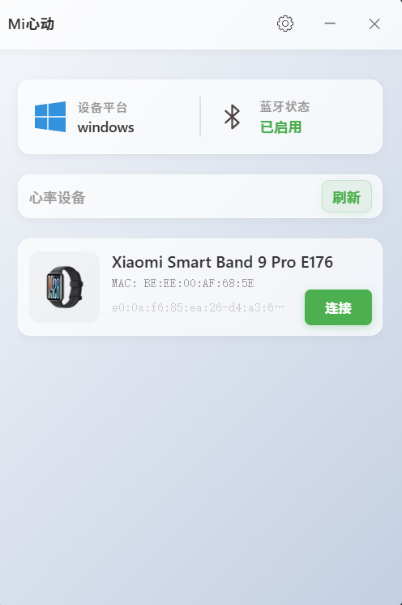
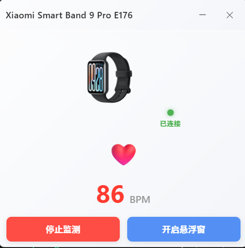
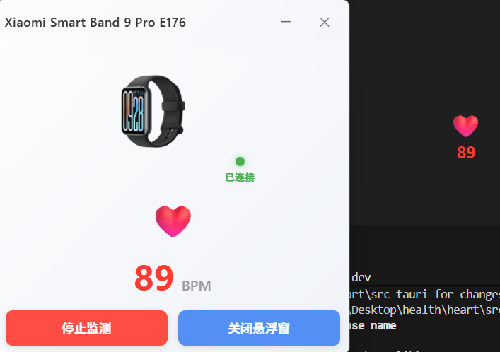

# MiHeartbeat  米心动

由于突然想起来手环有个心率广播的功能，app上面hyperate和keep等对心率广播的支持度都比较好，但是桌面端对于心率广播的支持多集中于ObsStudio插件，简单的实现或者是不支持小米先最新这几个版本的手环，所以做一个自己的桌面端，本来是打算自己用的。随手发个，欢迎二次开发。
rust代码灵感：[OBS直播显示小米手环 “运动心率广播” Demo](https://github.com/Tnze/miband-heart-rate))

## 运行截图

## 手环心率广播桌面端

目前客户端支持的操作系统

| 系统              | 是否支持 |
| ----------------- | -------- |
| Windows 10 及以上 | ✅ |
| Linux发行版 | 待测试 |
| Macos | 未知 |

目前已经测试的心率广播设备，理论上来说相同沟通协议的设备都可以支持

| 品牌 | 型号  | 是否支持 |
| ---- | ----- | ---- |
| 小米 | 9 Pro | ✅ |
|其它|其它|待验证|

## 开发计划

| 功能 | 完成度 |计划版本|
| ---- | ----- | ---- |
| 悬浮窗动画样式|||
|更多的悬浮窗设置|||
|历史数据记录可视化|||
|数据导出||||
|代码优化||||

### 相关信息

- 站点::  [tecgui.cn](https://tecgui.cn)
- 站点：[codelin.org](https://codelin.org)
- 开源协议: MIT

